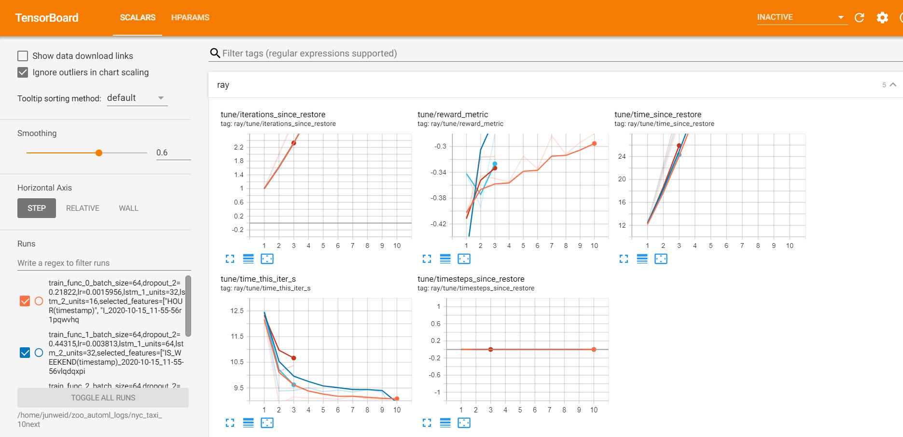

# Visualization

## AutoML visualization Overview

AutoML visualization provides two kinds of visualization.

1. During the searching process, the visualizations of each trail is shown and updated every 30 seconds.
2. After the searching process, a leaderboard of each trail's configs and metrics is shown.

Note that: AutoML visualization is based on tensorboard and tensorboardx. They should be installed properly before the training starts.

## Scalar view

Before training, start the tensorboard server through

```shell
tensorboard --logdir=/home/<username>/zoo_automl_logs/<job_name>/
```

where `<username>` is your system log in name and `<job_name>` is the name parameter you set for your predictor (e.g. *TimeSequencePredictor* in Automated Time Series Prediction).

The data in SCALARS tag will be updated every 30 seconds for users to see the training progress.



## Leaderboard view

After training, start the tensorboard server through

```shell
tensorboard --logdir=/home/<username>/zoo_automl_logs/<job_name>_leaderboard/
```

where `<username>` is your system log in name and `<job_name>` is the name parameter you set for your predictor (e.g. *TimeSequencePredictor* in Automated Time Series Prediction).

A leaderboard of each trail's configs and metrics is shown in the HPARAMS tag.


## Use visualization in Jupyter Notebook

You can enable a tensorboard view in jupyter notebook by the following code

```python
%load_ext tensorboard
# for scalar view
%tensorboard --logdir /home/<username>/zoo_automl_logs/<job_name>_leaderboard/
# for leaderboard view
%tensorboard --logdir /home/<username>/zoo_automl_logs/<job_name>/
```

