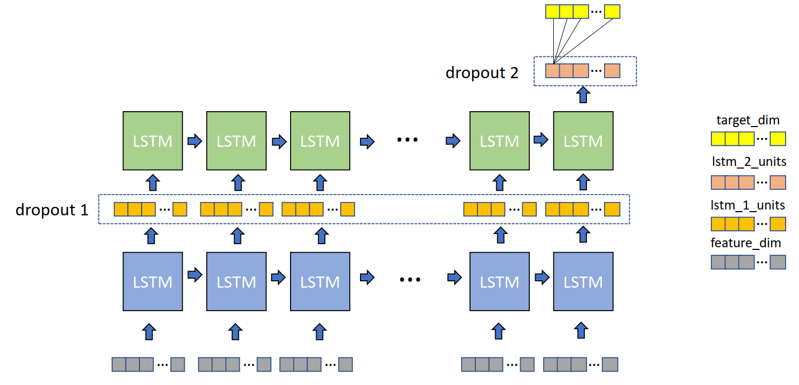

# LSTMForecaster

## Introduction

Long short-term memory(LSTM) is a special type of recurrent neural network(RNN). We implement the basic version of LSTM - VanillaLSTM for this forecaster for time-series forecasting task. It has two LSTM layers and a dense layer to LSTMForecaster is derived from tfpark.KerasMode, and can use all methods of KerasModel. Refer to [tfpark.KerasModel API Doc](../../APIGuide/TFPark/model.md) for details.

## Method

### Arguments

- **target_dim**: Specify the number of variables we want to forecast. i.e. the the dimension of model output feature. This value defaults to 1.
- **feature_dim**: Specify the number of variables we have in the input data. i.e. the the dimension of model input feature. This value defaults to 1.
- **lstm_1_units**: Specify the dimensionality of the output space for 1st LSTM layer. This value defaults to 16. 
- **dropout_1**: Specify the fraction of the input units to drop for the 1st dropout layer. This value defaults to 0.2.
- **lstm_2_units**: Specify the dimensionality of the output space for 2nd LSTM layer. This value defaults to 8. 
- **dropout_2**: Specify the fraction of the input units to drop for the 1st dropout layer. This value defaults to 0.2.
- **metric**: Specify the metric for validation and evaluation. This value defaults to MSE.
- **lr**: Specify the learning rate. This value defaults to 0.001.
- **uncertainty**: Specify whether the forecaster can perform the calculation of uncertainty.

### \__init__

```python
LSTMForecaster(target_dim=1,
               feature_dim=1,
               lstm_1_units=16,
               dropout_1=0.2,
               lstm_2_units=8,
               dropout_2=0.2,
               metric="mean_squared_error",
               lr=0.001,
               uncertainty: bool = False
            )
```

### fit, evaluate, predict

Refer to **fit**, **evaluate**, **predict** defined in [tfpark.KerasModel API Doc](https://github.com/intel-analytics/analytics-zoo/blob/master/docs/docs/APIGuide/TFPark/model.md)

## VanillaLSTM Algorithm

VanillaLSTM is constructed by two LSTM layers, two dropout layers and a dense layer. The flow chart is clearly plotted in the following plot. A more detailed LSTM unit structure can be found in [here](https://en.wikipedia.org/wiki/Long_short-term_memory).

