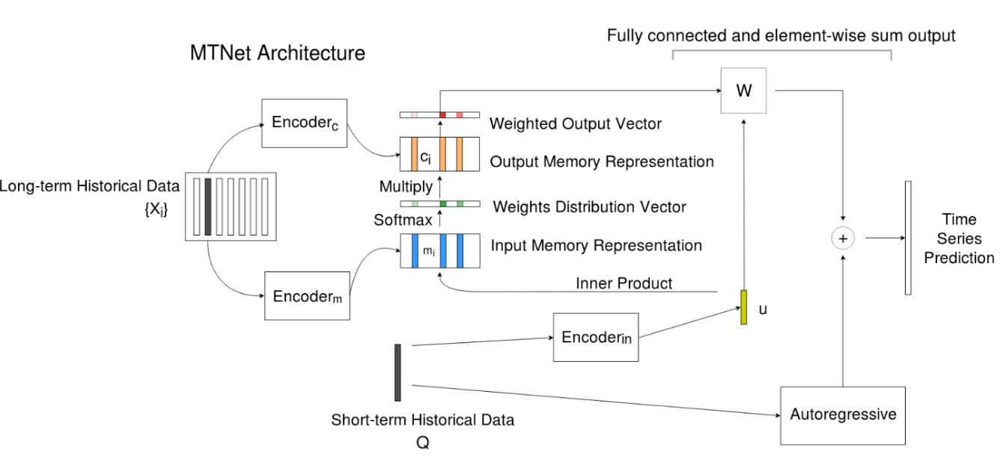

# MTNetForecaster

## Introduction

MTNet is a memory-network based solution for multivariate time-series forecasting. In a specific task of multivariate time-series forecasting, we have several variables observed in time series and we want to forecast some or all of the variables' value in a future time stamp.

MTNet is proposed by paper [A Memory-Network Based Solution for Multivariate Time-Series Forecasting](https://arxiv.org/abs/1809.02105). MTNetForecaster is derived from tfpark.KerasMode, and can use all methods of KerasModel. Refer to [tfpark.KerasModel API Doc](../../APIGuide/TFPark/model.md) for details.

## Method

### Arguments

- **`target_dim`**: Specify the number of variables we want to forecast. i.e. the the dimension of model output feature. This value defaults to 1.
- **`feature_dim`**: Specify the number of variables we have in the input data. i.e. the the dimension of model input feature. This value defaults to 1.
- **`lb_long_steps`**: Specify the number of long-term historical data series. This value defaults to 1. Typically, as stated in the [paper](https://arxiv.org/abs/1809.02105), the value is set to 7.
- **`lb_long_stepsize`**: Specify the length of long-term historical data series, which is equal to the length of short-term data series. This value defaults to 1. The value should be larger or equal to 1.
- **`ar_window_size`**: Specify the auto regression window size in MTNet. This value defaults to 1. Typically, the value is set between 1 to 3 as an integer. The value should larger or equal to `lb_long_stepsize`.
- **`cnn_kernel_size`**: Specify convolutional layer filter height in MTNet. This value defaults to 1. Typically, the value is set between 1 to 3 as an integer.
- **`metric`**: Specify the metric for validation and evaluation. This value defaults to MSE.
- **`uncertainty`**: Specify whether the forecaster can perform the calculation of uncertainty.

### \__init__

```python
MTNetForecaster(target_dim=1,
               feature_dim=1,
               lb_long_steps=1,
               lb_long_stepsize=1,
               ar_window_size=1,
               cnn_kernel_size=1,
               metric="mean_squared_error",
               uncertainty: bool = False,
            )

```

### fit, evaluate, predict

Refer to **fit**, **evaluate**, **predict** defined in [tfpark.KerasModel API Doc](../../APIGuide/TFPark/model.md)

## MTNet Algorithm

As we have mentioned before, MTNet is a memory-network based solution for multivariate time-series forecasting. The input data has a form of time series signal with several variables observed in each time stamp. Input data is divided into two parts, long-term historical data **{X_i}** and a short-term data series **Q**. Long-term historical data typically has several data series and each of them has the same length of the short-term data series.

One of the main modules of MTNet is its Encoder. It composes of three parts, a convolutional layer, an attention layer and a recurrent layer. For the convolutional layer, we have filters with width as the number of input feature `feature_dim` and height as `cnn_kernel_size`.  Then the convolution output is sent to a recurrent neural network with attention mechanism. The recurrent neural network is implemented as a GRU in this case.


As we have mentioned before, MTNet has two input, long-term historical data **{X_i}** and a short-term data series **Q**. The length of each long-term historical data series and the short-term data series is `lb_long_stepsize` and there are `lb_long_steps`  long-term historical data series in all (typically 7 as shown in this flow chart). Each **X_i** in **{X_i}** is encoded by the encoder to get `lb_long_steps` input memory representations **{m_i}**. Short-term data series is encoded by the encoder to get a query vector **u**.  By inner product between each **m_i** in **{m_i}** with **u** and a SoftMax operation, we get an attention weight distribution vector. The attention weight distribution vector is then element-wise multiplied by another encoded  representation **{c_i}** and get a weighted output **{o_i}**. The weighted output is concatenated with the query vector **u** and sent through a fully connected layer with output dimension as `target_dim`.



There is another auxiliary autoregressive model works independently. The autoregressive model assumes that the value to be forecasted is relevant to its previous value. `ar_window_size` states the number of previous value you want to use in the regression. The output feature number is also `target_dim`.

At last, the autoregressive model result is added with the memory network result to get the final time series prediction.

## Reference

Yen-YuChang, Fan-YunSun, Yueh-HuaWu, Shou-DeLin,  [A Memory-Network Based Solution for Multivariate Time-Series Forecasting](https://arxiv.org/abs/1809.02105). 

